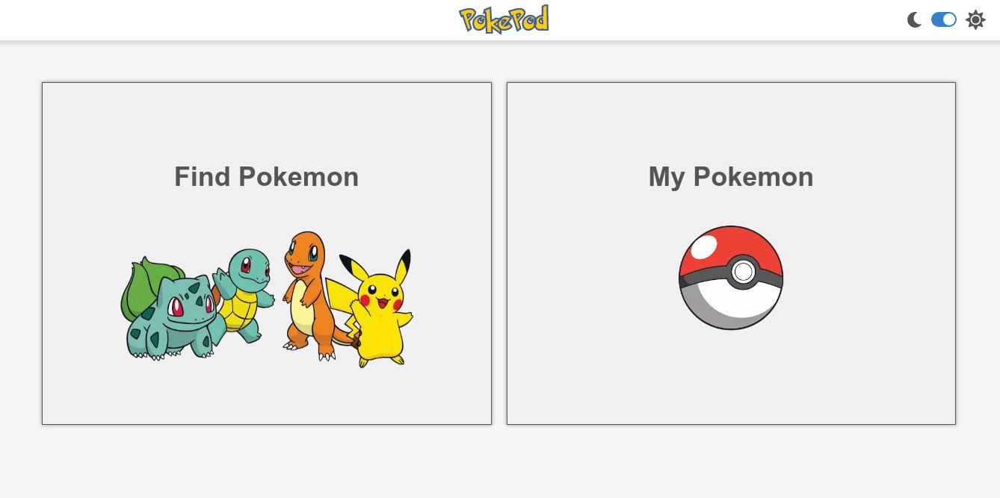

# Pokepod

This repo contains a website to visualize data from https://graphql-pokeapi.vercel.app/.

<div align="center">
  
</div>

Checkout https://pokepod.vercel.app

## How to use

### Requirements

- Browser (Recommended: Google Chrome v90+)
- Internet
- NodeJS 12+

### Installation

1. Clone repository

```
git clone --depth 1 --single-branch https://github.com/KY64/pokepod
```

2. Configure environment

Rename **.env.example** file to **.env** then set the value like the following example:

```
NEXT_PUBLIC_DBNAME=Pokepod
NEXT_PUBLIC_DBVERSION=3
NEXT_PUBLIC_API_ENDPOINT=https://graphql-pokeapi.graphcdn.app
```

The `NEXT_PUBLIC_API_ENDPOINT` **must** exactly the same with the example or you'll see a blank page. The rest value could be modified as you please.

3. Run local web server

```
npm i;
npm run build;
npm start
```
